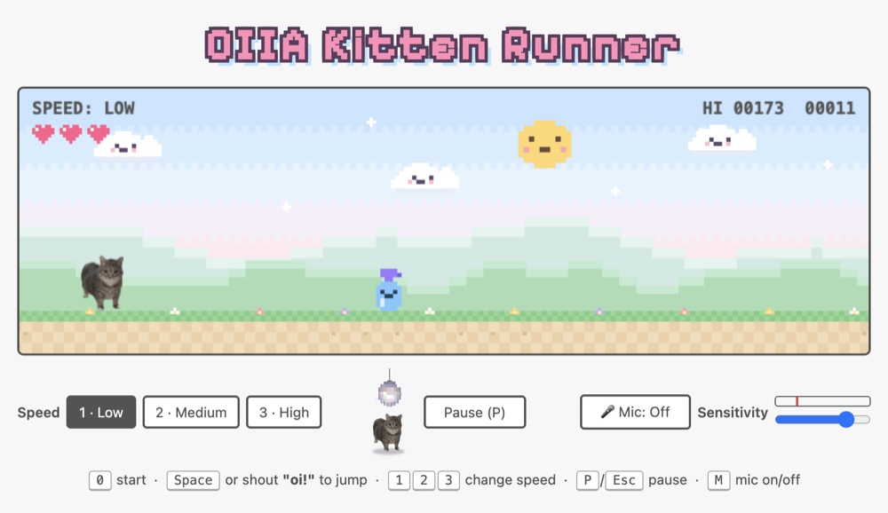

# OIIA Kitten Runner

A tiny endless-runner game, like Chrome's dinosaur game, starring the spinning OIIA cat.
Jump over cucumbers, vacuums, spray bottles and bees!



🪩 Psst — click the tiny cat under the disco ball next to Pause. The faster you click, the harder it OIIA-OIIAs.

## Run it

Download the files, then start a local server inside the folder:

```sh
python3 -m http.server 8000
```

Open http://localhost:8000 in your browser.

> The voice control needs the page served from `localhost` or `https`. Opening `index.html` directly works for keyboard play only.

## How to play

| Action | Control |
| --- | --- |
| Start / restart | `0` |
| Jump | `Space` or shout **"oi!"** |
| Change speed | `1` Low · `2` Medium · `3` High |
| Pause / resume | `P` or `Esc` |
| Mic on / off | `M` or the mic button |

- The game starts at **Low** speed. Change it any time (even while paused); restarts keep your choice.
- You have **3 lives** (hearts, top-left). After a hit the cat blinks and can't be hurt for a moment.
- Bees show up after 200 points. Low bees: jump. High bees: run under.

## Voice control

1. Click **🎤 Mic: Off** (or press `M`) and allow microphone access.
2. Shout "oi!" to jump.
3. Use the **Sensitivity** slider if it's too jumpy or not reacting. The red mark on the meter is the trigger level.
4. Click the button or press `M` again to turn the mic off.

## Credits

The OIIA cat image is from the official [W&W "OIIA OIIA (Spinning Cat)"](https://www.wandwmusic.com/oiia) page.
